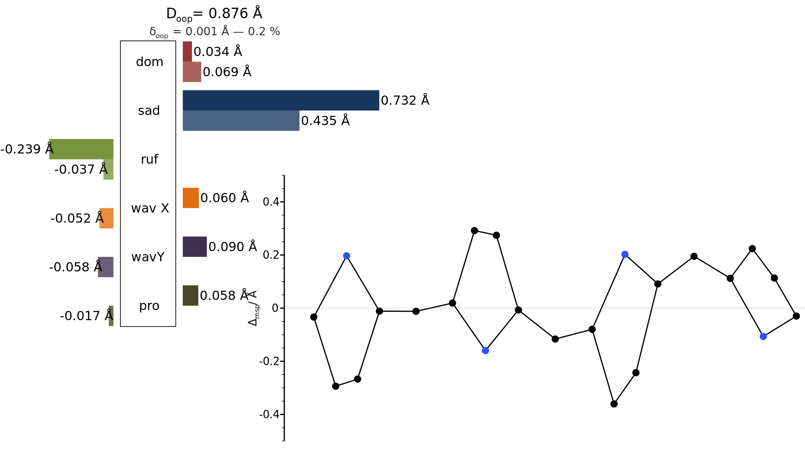
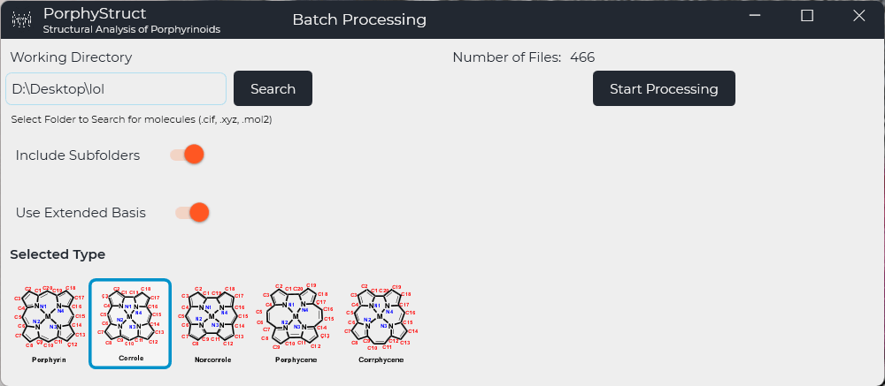

import { CardGrid, Card, Icon } from '@astrojs/starlight/components';

	<CardGrid>
	

	

	## Automated Conformational Analysis
	The conformation of tetrapyrrolic macrocycles significantly influences the reactivity and the (photo)physical properties. To analyse the conformation by creating displacement diagrams manually is possible, but costs a lot of time. Furthermore, a quantitative analysis is not easily possible. PorphyStruct offers automated creation of displacement diagrams and quantitative conformational Analysis using the NSD-technique.
	

	</CardGrid>

	<CardGrid>
	

	## Batch Processing
	The automated Analysis of thousands of structures is possible due to the implemented Batch processing feature. The Output will be merged into a csv file for further Analysis in Excel or as a Pandas DataFrame in Python scripts. Did you know? Some python scripts to Play with are available here: [porphystruct-scripts](https://github.com/jenskrumsieck/porphystruct-scripts).
	

	
	</CardGrid>

	

	## Supported Macrocyclic Frameworks
	- Porphyrin (e.g. Isoporphyrins, Phtalocyanines, N-confused Porphyrins, Porphyrazines)
	- Corrole (e.g. Isocorroles, Heterocorroles, N-confused Corroles, Corrolazines, Corrins¹)
	- Norcorrole
	- Corrphycene
	- Porphycene

	¹ NSD-type analysis not useful for Corrins, but diagrams are still possible.
	

<CardGrid>
	<Card title="Automatic Recognition" icon="rocket">
		Macrocycles can be detected automatically via a graph theory based algorithm - A wizard for manual Isolation of structures is also available.
	</Card>
	<Card title="Import/Export" icon="pen">
		Structures can be loaded from the industry standard filetypes .cif, .mol, .mol2, .xyz and .pdb. Data can be exported to Markdown (.md), .json, .csv and as Pictures (.png/.svg). 
	</Card>
	<Card title="Additional Parameters" icon="seti:config">
		Other important parameters like e.g. bond lengths, angles, dihedrals, helicity, interplanar angle and the N4-cavity are calculated automatically.
	</Card>
	<Card title="Modern Technology" icon="seti:c-sharp">
		PorphyStruct uses modern Technologies (.NET 7 and C# 11) and is Open Source. The source code is available on [GitHub](https://github.com/JensKrumsieck/PorphyStruct).
	</Card>
</CardGrid>

	

		<h2 class="flex gap-2 text-white">
		<Icon name="open-book" />
		Documentation		
		</h2>
		

			Documentation of the main features and concepts is available on our site. This will always be extended with new features or updated with changes. If you still have questions, please use our <a class="text-white hover:text-gray-400" href="https://github.com/JensKrumsieck/PorphyStruct/discussions">discussion function (GitHub)</a>.
		

		

			

				<h4 class="text-white">Getting started</h4>
				<ul>
					<li><a class="text-white hover:text-gray-400" href="/docs/getting-started">Introduction</a></li>
					<li><a class="text-white hover:text-gray-400" href="/docs/getting-started/download-and-installation">Download & Installation</a></li>
					<li><a class="text-white hover:text-gray-400" href="/docs/getting-started/user-interface">User Interface</a></li>
				</ul>
			

			

				<h4 class="text-white">Concepts</h4>
				<ul>
					<li><a class="text-white hover:text-gray-400" href="/docs/concepts/displacement-diagrams">Displacement Diagrams</a></li>
					<li><a class="text-white hover:text-gray-400" href="/docs/concepts/modes">Modes</a></li>
					<li><a class="text-white hover:text-gray-400" href="/docs/concepts/simulation-method">Simulation Method</a></li>
				</ul>
			

			

				<h4 class="text-white">Analysis</h4>
				<ul>
					<li><a class="text-white hover:text-gray-400" href="/docs/analysis/simple-analysis">Simple Analysis</a></li>
					<li><a class="text-white hover:text-gray-400" href="/docs/analysis/minimal-and-extended-basis">Minimal and Extended Basis</a></li>
					<li><a class="text-white hover:text-gray-400" href="/docs/analysis/data-interpretation">Data Interpretation</a></li>
					<li><a class="text-white hover:text-gray-400" href="/docs/analysis/export-plots-and-data">Export Plots and Data</a></li>
				</ul>
			

			

				<h4 class="text-white">Advanced Topics</h4>
				<ul>
					<li><a class="text-white hover:text-gray-400" href="/docs/advanced/batch-processing">Batch Processing</a></li>
					<li><a class="text-white hover:text-gray-400" href="/docs/advanced/comparisons">Comparisons</a></li>
					<li><a class="text-white hover:text-gray-400" href="/docs/advanced/quick-settings">Customization - Quick Settings</a></li>
					<li><a class="text-white hover:text-gray-400" href="/docs/advanced/structure-isolation">Structure Isolation</a></li>
					<li><a class="text-white hover:text-gray-400" href="/docs/advanced/troubleshooting-hints">Troubleshooting & Hints</a></li>
				</ul>
			

			

				<h4 class="text-white">Settings</h4>
				<ul>
					<li><a class="text-white hover:text-gray-400" href="/docs/settings/settings-data-color">Data & Color</a></li>
					<li><a class="text-white hover:text-gray-400" href="/docs/settings/settings-export-update">Export & Update</a></li>
					<li><a class="text-white hover:text-gray-400" href="/docs/settings/settings-graph">Graph</a></li>
				</ul>
			

		

	

